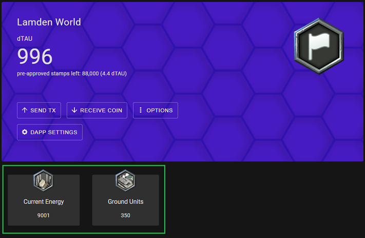

# Lamden Wallet Integration Example
When an application interacts with a blockchain it's referred to as a "dApp".
The [Lamden Wallet](https://github.com/Lamden/wallet) runs as a browser extention in Most modern browser (Safari not yet supported) and it allows your website (dApp) to interact with the Lamden Blockchain.

Using the interaction API outlined below your dApp will be able to do the following things:
- Quickly engage users of the Lamden Wallet to interact with your application quickly and effectivly
- Securely create and send transactions to the Lamden Wallet and get the results
- Have the user "auto approve" transactions to impreove the useability of your dApp
- Create and customize a space for your dApp inside the user's Lamden Wallet where you can keep them upto date and engaged

## Installation of Demo Website
** Site functional but also a Work in Progress **
```
git clone https://github.com/Lamden/wallet-integration-example.git
cd wallet-integration-example
npm install
```

## Run
```
npm run dev
open http://localhost:5000/ in broswer
```

# Install Lamden Wallet
[Follow Lamden Wallet install instructions](https://github.com/Lamden/wallet)

# Lamden Wallet API
Connections to the Lamden Wallet are defined and restricted in the following ways for the security of the user.
- The Lamden Wallet assocaites all interaction with the dApp via the dApp's host.  
    - All images used for customization are prefixed with the dApp's hostname when displayed in the wallet.
- A brand new keypair is created for your dApp in the Lamden Wallet and you are permitted to only transaction against that.
- A dApp can only approve 1 contract per network type (mockchain, testnet, mainnet)
    - The contract to be approved must exist on the network it's being approved on
- All transacations are locked to the approved contract for that network
    - this includes state variable lookups when creating charms
- All event detail is passed in JSON format.
- Wallet interactions are done via broswer events.
    - For security, no script tags are injected into the browser
- If Locked, the Lamden Wallet will return a "Wallet is Locked" error for all events except lamdenWalletGetInfo
    - It is up to the dApp to handle prompting the user to unlock their wallet

## Communicating with the Lamden Wallet 
| Event  | Type | Description  |
| ------------- |------------| -----|
| lamdenWalletGetInfo | CustomEvent | Ask the Wallet for the current info which includes version, installed/setup status, locked status, wallet key assigned to your dApp and which connection approvals you currently have |
| lamdenWalletConnect | CustomEvent | Send an inital connection request to have the wallet paired up with your dApp.  See below for API instructions. |
| lamdenWalletSendTx | CustomEvent | Send a transactions request to the wallet for transmission |
| lamdenWalletTxStatus | Event Listener | Results from your transactions request will be sent here  |
| lamdenWalletInfo | Event Listener | Results from your Information request will be sent here.  All locking and unlocking of the user's wallet will automatically generate an event here. |

**All event detail is passed in JSON format for security.**


## Create a Connection Request
Send a connection request via the "lamdenWalletConnect" event.  All event detail is passed in JSON format for security.

This is an example of a basic connection request
```javascript
const detail = JSON.stringify({
    appName: 'My Killer dApp',
    description: 'Welcome to My Killer dApp!',
    contractName: 'myDappContract',
    networkType: 'testnet',
})

document.dispatchEvent(new CustomEvent('lamdenWalletConnect', {detail}));
```

The user will get a broswer popup and be asked to connfirm your connection. On approval the Lamden Wallet will create a new key pair in the user's wallet and assign it to your dApp.
## Advanced Connection Requests Options

### Customize the Lamden Wallet
There are a few configuration options you can use to customize your dApps view in the Lamden Wallet. **All image paths are relative to your dApp's hostname.**

| Property  | Example Value | Description  |
| ------------- |------------| -----|
| logo | 'images/logo.png' | This logo will be displayed next to your associated keypair in the main Lamden Wallet view as well as displayed in your dApps section of the Lamden Wallet |
| background | 'images/background.png' | This is a custome background you can set to repalce the defualt on in your dApps section of the Lamden Wallet  |

```javascript
detail.logo = 'images/logo.png'
deatil.background = 'images/background.png'
```


### State Charms
Charms can be added to your dApps section of the Lamden Wallet and provide state information about your dApps's contract.  Example would a custome token value, the current player's turn in a game, etc.  There is no limit on the amount of charms you can add.  Define the charms and send them along with your initial connection request.  All image paths are relative to your dApp's hostname.

Key Vaiables<br>
&lt;wallet vk&gt; - The Lamden Wallet will subsitute the public key of the keypair created for your dApp<br>

```javascript
//for example
key = "players:<wallet vk>"
// Becomes
"players:270add00fc708791c97aeb5255107c770434bd2ab71c2e103fbee75e202aa15e"
```

```javascript
detail.charms = [
    //This creates a charm that always shows the wallets balance of Stu Bucks
    {
        //The label displayed on the charm
        name: "Stu Bucks"
        //The state variable in yoru dApp's contract
        variableName: "customToken",
        //described in section above this
        key: "<wallet vk>",
        //What format to display the returned value (number will also display as float)
        formatAs: "number",
        //Icon path is relative to your dDapp's hostname
        //This iconPath will become http://www.mydapp.com/images/token.png
        iconPath: "images/token.png",
    },
    //This creates a charm that always shows the current player's turn in a game
    {
        variableName: "playerTurn",
        formatAs: "string",
        iconPath: "images/player.png",
        name: "Player Turn"
    }
]
```



### Pre-Approved Transactions
Some dApps, expecially games can have a high amount of transfers.  This can lead your user to have to interact with the approve transcation popup too often. <br>
Your connection request can suggest to to the user that they pre-approve a certain amount of stamps, that will be used before another transactions popup is created.

```javascript
detail.preApproval: {
    stampsToPreApprove: 1000000, 
    message: 'This dApp requires a lot of transactions. To streamline the experience we recommed setting a pre-approve amount.'
}
```

### RE-Approving Your Application
Any subsequent connection requests sent to the Lamden Wallet will bouce back the error **App is already authorized to use &lt;your contract&gt; on &lt;requested network&gt;**
If you wish the change any of the information that was initially approved, such as the contract name, icon paths, charms, etc you can set the "reappove" flag on the connection request and the user will get an approve popup to confirm your new changes.

```javascript
detail.reapprove = true
```
It could happen that a user deleted the keypair that was created for your dApp previously, and now is trying to connect to your dApp again.  <br>
In that case you will get this error: <br>
**Your dDapp was previoulsy approved but no matching vk is currently found in the wallet. Prompt the user to restore their keypair for &lt;previous vk&gt;, or send a "reapprove request" to have another keypair generated.** <br>

If you need to generate a new keypair you can specify the newKeypair flag like this. A brand new keypair will be generated in the Lamden Wallet and associated to your dApp.
```javascript
detail.newKeypair = true
```

## Getting Wallet Information
Wallet Information Details: 
- Listening to 'lamdenWalletInfo' will provide you the info object everytime the user locks and unlocks their wallet
- 'wallets' and 'approvals' will return empty until the user unlocks the Lamden Wallet

This example assumes your dApp has been approved usign the steps above
```javascript
document.addEventListener('lamdenWalletInfo', (response) => {
    if (response.locked){
        //Prompt user to unlock wallet
    }else{
        //Do something
    } 
});
// Get Wallet Info
document.dispatchEvent(new CustomEvent('lamdenWalletGetInfo'));

```

| Property  | Description  |
| ------------- | -----|
| version | The version of the installed Lamden Wallet you are conencted to |
| installed | Boolean: Wallet is installed in the broswer |
| setup | Boolean: If the user has run the Lamden Wallet through the inital setup |
| locked | Boolean: If the wallet is locked or not |
| wallets | The Lamden public key your dApp was assigned.  There will only ever be 1 value in this array. |
| approvals | The contracts you currently have aprroved on which networks |

## Sending Transaction Requests
- Transactions are locked to the name of the contract that was approved durring the connection request.
- The Lamden Wallet will automatically supply this information to your transactions
    - contractName: what was supplied in the connection request
    - senderVk: The public key of the keypair associated to your dApp
    - network: The masternode information for the network type in the request (mainnet, testnet, mockchain)
    - signature: The Lamden Wallet will sign the transaction with the keypair assocatied with your dApp.

### Send a transaction
```javascript
const detail = JSON.stringify({
    //Which Lamden Network to send this to
    //mainnet, testnet or mockchain are the only acceptable values
    networkType: 'mainnet', 
    //The method in your contract to call
    methodName: 'movePlayer', 
    //The argument values for your method
    kwargs: {
        newPosX: 3,
        newPosY: 14
    }, 
    //The maximum amount of stamps this transaction is allowed to use
    //Could you less but won't be allowed to use more
    stampLimit: 30000
});
//Send transaction to the wallet
document.dispatchEvent(new CustomEvent('lamdenWalletSendTx', {detail}));

```

### Listen for the result
- On mainnet and testnet you will get two transaction responses
- On mockchain you will get just the second
```javascript
document.addEventListener('lamdenWalletTxStatus', (response) => {
    if (response.resultInfo.type === 'error') {
        console.log(response.resultInfo.errors)
        //Handle Errors
    }else{
        //Do soemething
    } 
});

```

#### Response object
This information is avaiable in both responses
| Property | Description |
| ------------- | -----|
| status | "success" or "error"|
| uid | a unique ID assigned to your tx by the Lamden Wallet.  Not needed for anything. |
| txHash | The hash assigned to your transaction by the network |
| signed | transaction was successfully signed |
| signature | the signature of your transaction |
| networkInfo | masternode info your transaction was sent to |
| txInfo | The information used to create your transaction |
| txSendResult | the response recieved back from the masternode |
| resultInfo | A success / failure object created from the txSendResult |
|  nonceResult | Information on the nonce recieved from the masternode |
| txBlockResult | Will be empty on first response |

#### txBlockResult
Only available on the second response
| Property | Description |
| ------------- | -----|
|hash | Your transaction hash |
|stampsUsed | The stamp cost of your transaction |
|state | The state changes caused by your transaction |
|status | status code |
|transaction | the transaction payload sent to the masternode |
|timestamp | date/time stamp |

